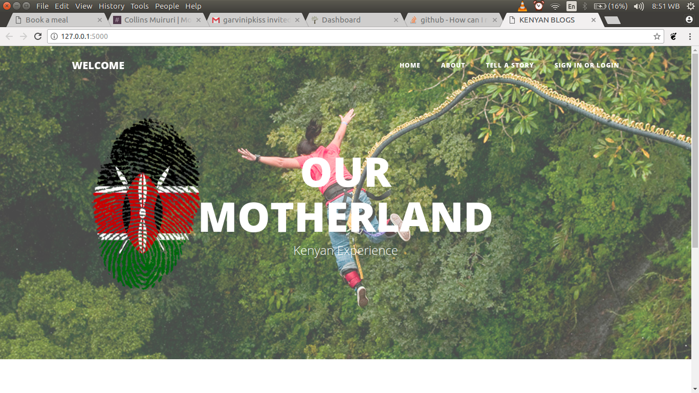

## KENYAN BLOGS

# AUTHOR

Enock OMONDI

# DESCRIPTION

This is a web app that allows users to tell stories about their kenyan experience

#### users can
* view the blog posts submitted by other users
* follow the most recent posts
* get a notification when a new blog gets added.
* comment on blogs

#### writer can

* sign in to the blog application.
* delete comments.
* create blog from the application.
* update or delete blogs.

## Tech Used

* python3.6
* flask
* sqlite3
* HTML5/CSS
* Bootstrap

## Installation steps
Setup

* Install python3.6
* git clone https://github.com/EnockOMONDI/BLOG-V1.0
* run 'python3.6 manage.py runserver' from the terminal

# How it works

* A user needs to sign up
* A user the needs to sign in order to write blogs

# Support and Contacts

In case You have any issues using this code please do no hesitate to get in touch with me through djseanizellkenya@gmail.com or leave a commit here on github.

# License

* MIT License

Copyright (c) 2017 EnockOMONDI

Permission is hereby granted, free of charge, to any person obtaining a copy
of this software and associated documentation files (the "Software"), to deal
in the Software without restriction, including without limitation the rights
to use, copy, modify, merge, publish, distribute, sublicense, and/or sell
copies of the Software, and to permit persons to whom the Software is
furnished to do so, subject to the following conditions:

The above copyright notice and this permission notice shall be included in all
copies or substantial portions of the Software.

THE SOFTWARE IS PROVIDED "AS IS", WITHOUT WARRANTY OF ANY KIND, EXPRESS OR
IMPLIED, INCLUDING BUT NOT LIMITED TO THE WARRANTIES OF MERCHANTABILITY,
FITNESS FOR A PARTICULAR PURPOSE AND NONINFRINGEMENT. IN NO EVENT SHALL THE
AUTHORS OR COPYRIGHT HOLDERS BE LIABLE FOR ANY CLAIM, DAMAGES OR OTHER
LIABILITY, WHETHER IN AN ACTION OF CONTRACT, TORT OR OTHERWISE, ARISING FROM,
OUT OF OR IN CONNECTION WITH THE SOFTWARE OR THE USE OR OTHER DEALINGS IN THE
SOFTWARE.*

Copyright (c) 2017 ** [EnockOMONDI]**
